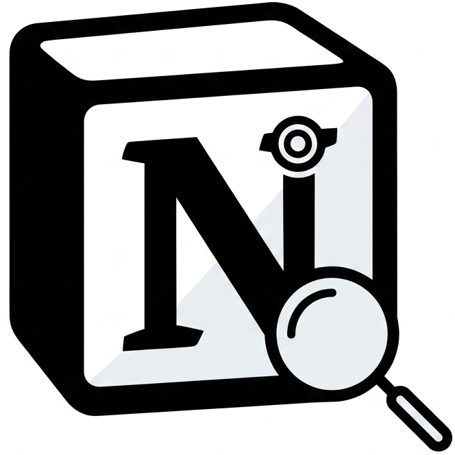

# Notion Lens

A Chrome extension that gives you a side panel for asking questions about
your own Notion workspace, answered with citations back to the exact pages
they came from.



## What it does

- **Connect** your Notion workspace via OAuth — no API keys to copy/paste,
  just the standard Notion "Add connections" consent flow.
- **Sync** pulls every page the integration can see, chunks it, embeds it,
  and stores it in Postgres. Re-syncing only re-processes pages that are
  new or have changed since the last sync. Auto-sync runs at most once a
  day per connection, either when you open the side panel or via a
  background scheduler.
- **Ask questions** in the side panel and get a grounded answer with
  numbered citations back to the source Notion pages. Retrieval is
  hybrid — vector (semantic) search and PostgreSQL full-text (keyword)
  search are merged with Reciprocal Rank Fusion, so both paraphrased
  questions and exact-term lookups work well.
- **Add pages** later without disconnecting — the same OAuth flow reopens
  Notion's page picker with your prior selections kept, and a sync kicks
  off immediately so newly-shared pages show up fast.

## Architecture

Two parts, no shared build step:

- **Extension** (repo root) — `manifest.json`, `background.js`,
  `sidepanel.html/css/js`. Plain vanilla JS/HTML/CSS, no bundler, no
  `package.json`.
- **Backend** (`backend/`) — a FastAPI service that owns the Notion OAuth
  flow, ingestion pipeline, and the RAG query endpoint. Postgres +
  [pgvector](https://github.com/pgvector/pgvector) is the only external
  dependency.

```
Chrome side panel  <--->  FastAPI backend  <--->  Notion API
                                |
                                v
                        Postgres + pgvector
                       (pages, chunks, embeddings)
                                |
                                v
                   NVIDIA NIM (embeddings + generation)
```

Chat is stateless server-side: the side panel resends trimmed recent
history with each question rather than the backend persisting a
conversation.

## Tech stack

- Extension: vanilla JS, Chrome Manifest V3 (`sidePanel`, `scripting`,
  `storage`)
- Backend: FastAPI, SQLAlchemy, Alembic, APScheduler
- Storage: Postgres with the `pgvector` extension (HNSW index for
  similarity search, `tsvector`/GIN for keyword search)
- Models: NVIDIA NIM-hosted embedding and chat-completion models

## Getting started

See **[SETUP.md](SETUP.md)** for the full local setup walkthrough
(Postgres, a Notion integration, environment variables, running the
backend, and loading the extension in Chrome).

## Repo layout

See `CLAUDE.md` for a detailed file-by-file reference of the backend and
extension code.
